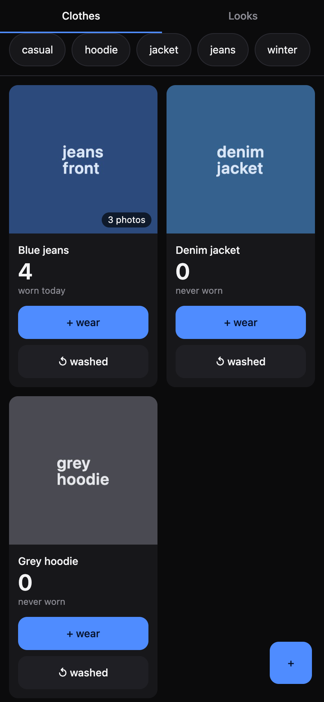
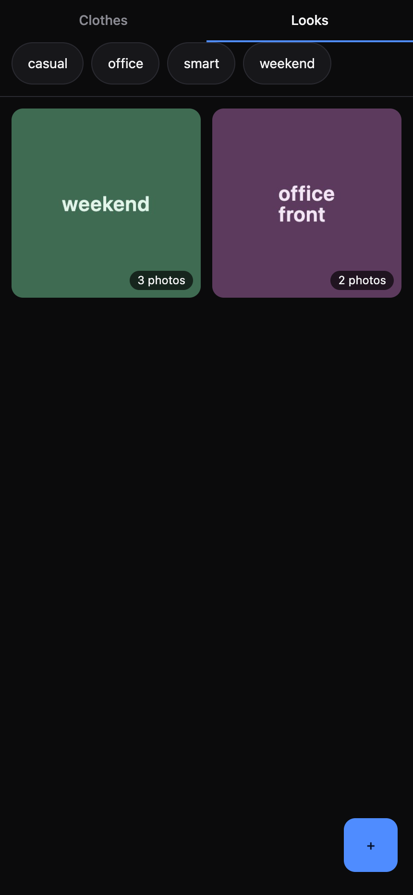
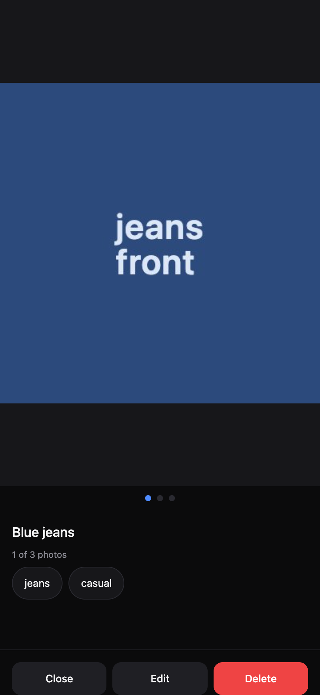
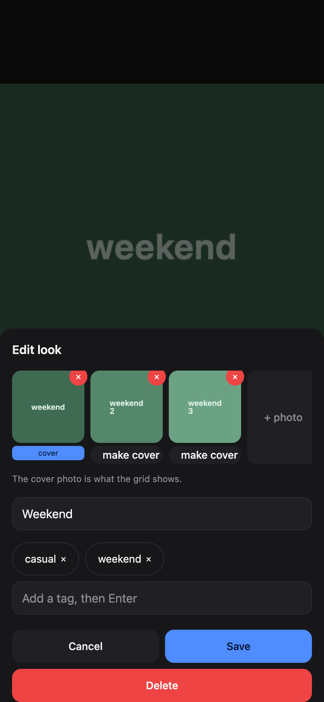

# closet-app

Track how many times a garment has been worn since its last wash, plus a tagged gallery of outfit photos.

## Setup
- `npm install`
- Copy the dev vars example file to the dev vars file (with a dot) and fill in secrets
- `npm run db:local`
- `npm run dev:local`
- use **:5173** for UI work

## Screens

Two tabs, mobile-first, one thumb.

| Clothes | Looks |
|---|---|
|  |  |

| Catalogue viewer | Editing the catalogue |
|---|---|
|  |  |

**Every cloth and every look is a catalogue** — it holds any number of photos
(front, back, worn, different angles), up to 12. The first photo is the cover
and is what the grid tile shows.

- **Clothes** — a photo grid, sorted highest-wear-first. Each tile has three
  separate tap targets: the **photo** opens the garment's catalogue, **+ wear**
  logs a wear (+1), and **↺ washed** confirms then resets the count to 0.
  A tile with more than one photo shows an "N photos" badge. A missing or
  failed photo falls back to a letter placeholder, and **+ wear** stays enabled
  either way — a missing picture must never block logging a wear.
- **Looks** — a plain tagged gallery of outfits. Looks never link to clothes and
  there is no "I wore this look" action (owner decision, 2026-08-17).
- **The catalogue viewer is identical on both tabs** (owner decision,
  2026-08-17). Swipe horizontally through the photos — CSS scroll-snap, so
  momentum and rubber-banding are the browser's own. Dots show the position.
  Buttons: Close, Edit, Delete. There is deliberately **no wear button here**,
  so browsing a catalogue can never change a count.
- **Editing photos** — the edit sheet holds the ordered strip: `×` removes a
  photo, **make cover** moves one to the front, `+ photo` adds (multi-select
  supported). The viewer stays open behind the sheet, so saving drops you back
  into the catalogue showing the new photos.
- **Undo** — every wear or wash shows a 10-second Undo bar so a one-handed
  mis-tap costs one tap to fix.
- **Tags** — one shared, autocompleting vocabulary across both tabs. The chip
  row filters with **AND** semantics: stacking chips narrows the grid, never
  widens it. The tag selection clears whenever you switch tabs.

## Endpoints

| Method | Path | Auth | Body → Response |
|---|---|---|---|
| POST | `/auth/login` | no | `{password}` → `{ok:true}` + cookie, or `401 {error}` |
| POST | `/auth/logout` | no | → `{ok:true}` |
| GET | `/api/me` | no | → `{authenticated:boolean}` |
| GET | `/api/state` | yes | → `{clothes,looks,tags,item_tags,photos}` |
| POST | `/api/photos` | yes | raw image bytes → `201 {key}` |
| GET | `/api/photos/:key` | yes | → image bytes, or `404` |
| POST | `/api/clothes` | yes | `{name,tags?,photo_keys?}` → `201` Cloth |
| PATCH | `/api/clothes/:id` | yes | `{name?,tags?,photo_keys?}` → Cloth, or `404` |
| DELETE | `/api/clothes/:id` | yes | → `{ok:true}` |
| POST | `/api/clothes/:id/wear` | yes | → `{cloth,event_id}`, or `404` |
| POST | `/api/clothes/:id/wash` | yes | → `{cloth,event_id}`, or `404` |
| POST | `/api/events/:id/undo` | yes | → `{cloth}`, or `404` |
| POST | `/api/looks` | yes | `{name?,tags?,photo_keys}` → `201` Look (≥1 photo required) |
| PATCH | `/api/looks/:id` | yes | `{name?,tags?,photo_keys?}` → Look, or `404` |
| DELETE | `/api/looks/:id` | yes | → `{ok:true}` |
| GET | `*` | no | SPA via `ASSETS` |

**`photo_keys` is always the item's WHOLE ordered photo set, cover first.** Add,
remove, reorder and change-cover are all expressed by that one field, which is
why there are no separate photo endpoints. The Worker diffs the list and deletes
any R2 object nothing references any more. Capped at 12 per item (extra keys are
silently clamped, not rejected).

## Schema Design Decisions
- **No wash limit**: There is no wash limit or threshold flag; a garment carries a raw wear count and the owner decides when to wash it.
- **Looks do not link to clothes**: `looks` is a plain tagged gallery — it deliberately has NO link to `clothes`.
- **Photos live in their own table, not a column** (2026-08-17): `photos(item_type, item_id, r2_key, position)`. `position 0` **is** the cover — there is no separate cover flag that could disagree with the ordering. Replaced the old single `photo_key` column; see `migrations/2026-08-17-photos.sql`.
- **A look must have ≥1 photo; a cloth may have 0.** A look *is* its pictures, so one with none would render as an untappable blank. A cloth falls back to its initial letter and stays fully usable.

## Migrations

`schema.sql` is the current shape and is all a fresh database needs. Already-provisioned
databases apply the one-off files in `migrations/` once:

```bash
npx wrangler d1 execute closet-db --remote --file=./migrations/2026-08-17-photos.sql
```

## First remote deploy (owner only)
1. `npx wrangler d1 create closet-db` → paste the real `database_id` into `wrangler.toml`
2. `npx wrangler r2 bucket create closet-photos`
3. `npm run db:remote`
4. `npx wrangler secret put APP_PASSWORD` and `npx wrangler secret put SESSION_SECRET`
5. `npm run deploy` → Cloudflare auto-provisions DNS + SSL for `closet.agrolloo.com`
6. Add the app to `INFRA.md` and `my-hosted-sites.md`
