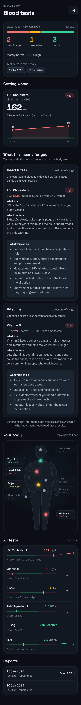

# kushal-health (Kushal Health)

The owner's health tracker at https://kushal-health.agrolloo.com. PIN-gated.

First tab: **Blood tests**. Every marker from every lab report, over time, against its
reference range, with a verdict on the latest report.

## How reports get in

There is no upload button. In a Claude session, say "add my blood report <path to PDF>".
The `kushal-health` skill (`.claude/skills/kushal-health/`) reads the PDF, shows you every
value to check, writes a short verdict, then runs `scripts/push-report.mjs`, which posts the
numbers to `POST /api/reports` and the PDF to R2.

## How the verdict works

- Colours and trends come from fixed rules in `src/shared/status.ts`: out of range, near the
  edge (within 10% of the range from a limit), normal, and better / worse / steady against
  the previous reading.
- The written verdict per report is Claude's, stored in `reports.verdict` at ingest time.

## Stack

Worker (Hono) + D1 + R2 `kushal-health-reports`; Vite + React client in `src/client`.
Auth: shared-PIN HMAC cookie (copied from `apps/kushal-income`).

The D1 is **`kushal-money`, shared with kushal-income**: the Cloudflare account is at its
10-database free limit (2026-10-06). Health owns only `reports`, `markers` and `results`, and
tracks its migrations in its own `health_migrations` table.

## Commands

| What | Command |
|---|---|
| Local app | `cp .dev.vars.example .dev.vars && npm run db:local && npm run dev:local` (PIN `1234`) |
| Typecheck | `npm run typecheck` |
| Tests | `npm test` |
| Smoke (real wrangler, local D1 + R2) | `npm run build && bash scripts/smoke.sh` |
| Screenshot | `node scripts/shoot.mjs <url> <out.png> --login=<pin>` |
| Deploy | `npm run deploy` |

## Setup (done 2026-10-06)

R2 bucket created, `npm run db:remote` applied, secrets `APP_PASSWORD` / `SESSION_SECRET` /
`INGEST_TOKEN` set, deployed. A schema change: add `migrations/000N_*.sql`, then
`npm run db:remote` before `npm run deploy`.

On a new machine, `.ingest.env` is missing: copy `.ingest.env.example`, then either paste the
current token or make a new one and set it with `npx wrangler secret put INGEST_TOKEN`.
