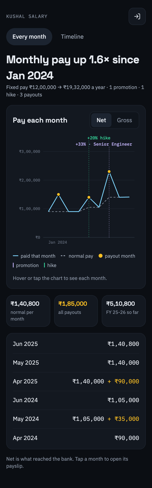

# kushal-salary (Kushal Salary)

The owner's salary history at https://kushal-salary.agrolloo.com. PIN-gated.

Two tabs:

- **Every month**: a line chart. The solid line is what was paid each month, so payouts
  (variable pay, bonus, back-pay) show as spikes with an amber dot; the dashed line is normal
  pay. Promotions and hikes are vertical markers. Hover or tap for the month's full numbers.
  Net by default, with a Gross toggle.
- **Timeline**: promotions, hikes, payouts and HR mail notes (appraisal letters, "revised
  salary" mails), newest first.

## How payslips get in

There is no upload button. In a Claude session, say "add my payslips". The `kushal-salary`
skill (`.claude/skills/kushal-salary/`) finds new RazorpayX payslips (in Gmail or a folder),
shows the numbers to check, then runs `scripts/push-month.mjs`, which parses each PDF with
`scripts/parse-slip.mjs`, posts the numbers to `POST /api/months` and the PDF to R2. Mail notes
go in through `scripts/push-note.mjs`.

## How events are found

All rules live in `src/shared/salary.ts`:

- **Promotion**: the job title on the payslip changes.
- **Hike**: fixed monthly pay changes by 5% or more. A raise paid with back-pay is dated back
  by (arrears / raise per month) months.
- **Payout**: any variable item (Variable Pay, Bonus, Incentive...) or arrears.
- **Normal net** of a payout month = the net of the nearest payout-free month on the same fixed
  pay, so the amber part is what the payout added after tax.

## Stack

Worker (Hono) + D1 + R2 `kushal-salary-slips`; Vite + React client in `src/client`. Auth:
shared-PIN HMAC cookie (copied from `apps/kushal-health`).

The D1 is **`kushal-money`, shared with kushal-income and kushal-health**: the Cloudflare account
is at its 10-database free limit. Salary owns only `salary_months`, `salary_items` and
`salary_notes`, with its own `salary_migrations` table.

## Commands

| What | Command |
|---|---|
| Local app | `cp .dev.vars.example .dev.vars && npm run db:local && npm run dev:local` (PIN `1234`) |
| Typecheck | `npm run typecheck` |
| Tests | `npm test` |
| Smoke (real wrangler, local D1 + R2) | `npm run build && bash scripts/smoke.sh` |
| Parse one payslip | `node scripts/parse-slip.mjs <payslip.pdf>` |
| Screenshot | `node scripts/shoot.mjs <url> <out.png> --login=<pin>` |
| Deploy | `npm run deploy` |

## First deploy

1. `npx wrangler r2 bucket create kushal-salary-slips`
2. `npm run db:remote`
3. `npx wrangler secret put APP_PASSWORD` (the PIN), `SESSION_SECRET`, `INGEST_TOKEN`
4. `npm run deploy`, then redeploy `apps/kushal-tools` for the hub card.
5. Copy `.ingest.env.example` to `.ingest.env` with the same `INGEST_TOKEN`.

A schema change: add `migrations/000N_*.sql`, then `npm run db:remote` before `npm run deploy`.
