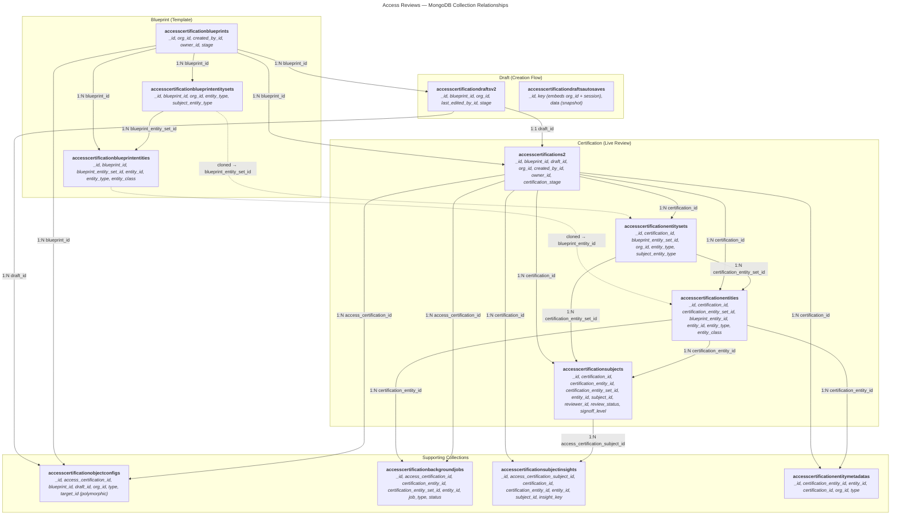

# Access Reviews — MongoDB Collection Relationships

## Relationship Summary

| From → To | FK field | Cardinality |
|---|---|---|
| `accesscertificationblueprints` → `accesscertificationblueprintentitysets` | `blueprint_id` | 1:N |
| `accesscertificationblueprintentitysets` → `accesscertificationblueprintentities` | `blueprint_entity_set_id` | 1:N |
| `accesscertificationblueprints` → `accesscertificationdraftsv2` | `blueprint_id` | 1:N |
| `accesscertificationblueprints` → `accesscertifications2` | `blueprint_id` | 1:N |
| `accesscertificationdraftsv2` → `accesscertifications2` | `draft_id` | 1:1 |
| `accesscertifications2` → `accesscertificationentitysets` | `certification_id` | 1:N |
| `accesscertificationentitysets` → `accesscertificationentities` | `certification_entity_set_id` | 1:N |
| `accesscertificationentities` → `accesscertificationsubjects` | `certification_entity_id` | 1:N |
| `accesscertificationsubjects` → `accesscertificationsubjectinsights` | `access_certification_subject_id` | 1:N |
| `accesscertificationentities` → `accesscertificationentitymetadatas` | `certification_entity_id` | 1:N |
| `accesscertifications2` → `accesscertificationbackgroundjobs` | `access_certification_id` | 1:N |
| `accesscertifications2` → `accesscertificationobjectconfigs` | `access_certification_id` | 1:N |
| `accesscertificationblueprintentitysets` ⇢ `accesscertificationentitysets` | `blueprint_entity_set_id` (lineage) | 1:N |
| `accesscertificationblueprintentities` ⇢ `accesscertificationentities` | `blueprint_entity_id` (lineage) | 1:N |

> `accesscertificationdraftsautosaves` is a TTL key-value store with no direct FK references — the `key` string embeds org_id and a session UUID.

> `accesscertificationobjectconfigs.target_id` is polymorphic — the `type` field determines which collection `target_id` points to (entity_set, entity, blueprint_entity, etc.).
